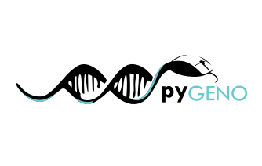

.. pyGeno documentation master file, created by
   sphinx-quickstart on Thu Nov  6 16:45:34 2014.
   You can adapt this file completely to your liking, but it should at least
   contain the root `toctree` directive.

pyGeno: A Python package for precision medicine and proteogenomics
===================================================================
.. image:: https://img.shields.io/badge/License-Apache%202.0-blue.svg
    :target: https://opensource.org/licenses/Apache-2.0
.. image:: https://img.shields.io/badge/python-3.5-blue.svg

pyGeno's `lair is on Github`_.

.. _lair is on Github: http://www.github.com/tariqdaouda/pyGeno

Citing pyGeno:
--------------

Please cite this paper_.

.. _paper: http://f1000research.com/articles/5-381/v1

A Quick Intro:
-----------------

Even tough more and more research focuses on Personalized/Precision Medicine, treatments that are specically tailored to the patient, pyGeno is (to our knowlege) the only tool available that will gladly build your specific genomes for you and you give an easy access to them.

pyGeno allows you to create and work on **Personalized Genomes**: custom genomes that you create by combining a reference genome, sets of polymorphims and an optional filter.
pyGeno will take care of applying the filter and inserting the polymorphisms at their right place, so you get
direct access to the DNA and Protein sequences of your patients/subjects.
To know more about how to create a Personalized Genome, have a look at the :doc:`/quickstart` section.

pyGeno can also function as a personal bioinformatic database for Ensembl, that runs directly into python, on your laptop, making faster and more reliable than any REST API. pyGeno makes extracting data such as gene sequences a breeze, and is designed to
be able cope with huge queries.

.. code::

    from pyGeno.Genome import *

    # In case the Genome cannot be found (i.e., KeyError), please consider the below section on bootstrapping
    g = Genome(name = "GRCh37.75")
    prot = g.get(Protein, id = 'ENSP00000438917')[0]
    #print the protein sequence
    print(prot.sequence)
    #print the protein's gene biotype
    print(prot.gene.biotype)
    #print protein's transcript sequence
    print(prot.transcript.sequence)

    #fancy queries
    for exons in g.get(Exons, {"CDS_start >": x1, "CDS_end <=" : x2, "chromosome.number" : "22"}) :
        #print the exon's coding sequence
        print(exon.CDS)
        #print the exon's transcript sequence
        print(exon.transcript.sequence)

    #You can do the same for your subject specific genomes
    #by combining a reference genome with polymorphisms
    g = Genome(name = "GRCh37.75", SNPs = ["STY21_RNA"], SNPFilter = MyFilter())

Verbose Introduction
---------------------

pyGeno integrates:

* **Reference sequences** and annotations from **Ensembl**

* Genomic polymorphisms from the **dbSNP** database

* SNPs from **next-gen** sequencing

pyGeno is a python package that  was designed to be:

* Fast to install. It has no dependencies but its own backend: `rabaDB`_.
* Fast to run and memory efficient, so you can use it on your laptop.
* Fast to use. No queries to foreign APIs all the data rests on your computer, so it is readily accessible when you need it.
* Fast to learn. One single function **get()** can do the job of several other tools at once.

It also comes with:

* Parsers for: FASTA, FASTQ, GTF, VCF, CSV.
* Useful tools for translation etc...
* Optimised genome indexation with *Segment Trees*.
* A funky *Progress Bar*.

One of the the coolest things about pyGeno is that it also allows to quickly create **personalized genomes**.
Genomes that you design yourself by combining a reference genome and SNP sets derived from dbSNP or next-gen sequencing.

pyGeno is developed by `Tariq Daouda`_ at the *Institute for Research in Immunology and Cancer* (IRIC_), its logo is the work of the freelance designer `Sawssan Kaddoura`_.
For the latest news about pyGeno, you can follow me on twitter `@tariqdaouda`_.

.. _rabaDB: https://github.com/tariqdaouda/rabaDB
.. _Tariq Daouda: http://www.tariqdaouda.com
.. _IRIC: http://www.iric.ca
.. _Sawssan Kaddoura: http://www.sawssankaddoura.com
.. _@tariqdaouda: https://www.twitter.com/tariqdaouda

Contents:
----------

.. toctree::
   :maxdepth: 2

   publications
   quickstart
   installation
   bootstraping
   querying
   importation
   datawraps
   objects
   snp_filter
   tools
   parsers
   citing

Indices and tables
==================

* :ref:`genindex`
* :ref:`modindex`
* :ref:`search`

